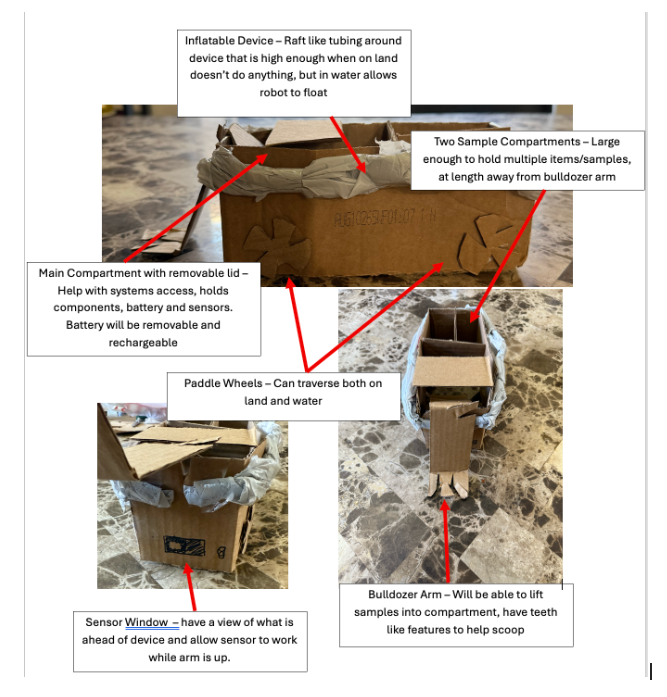
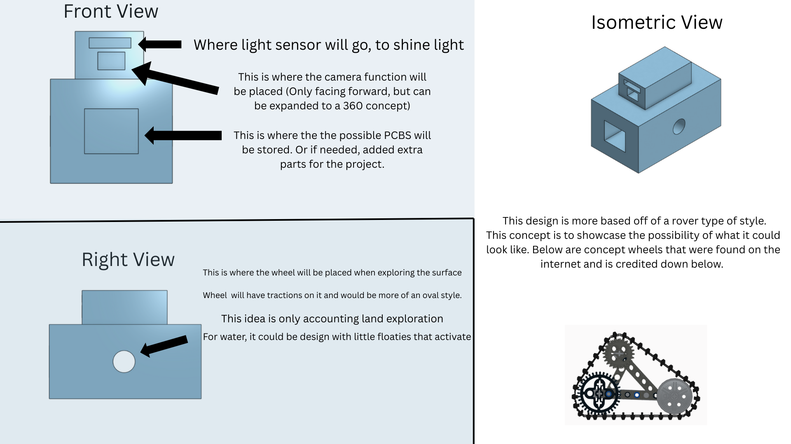
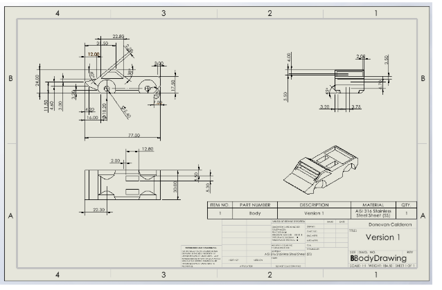
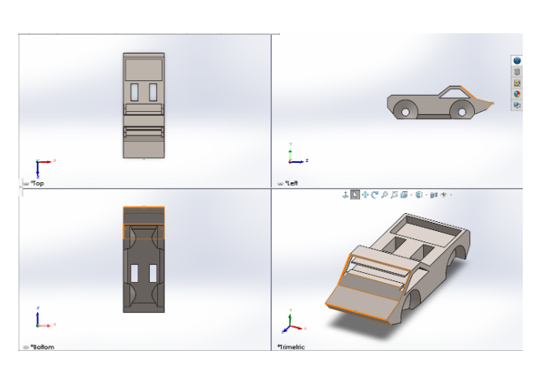
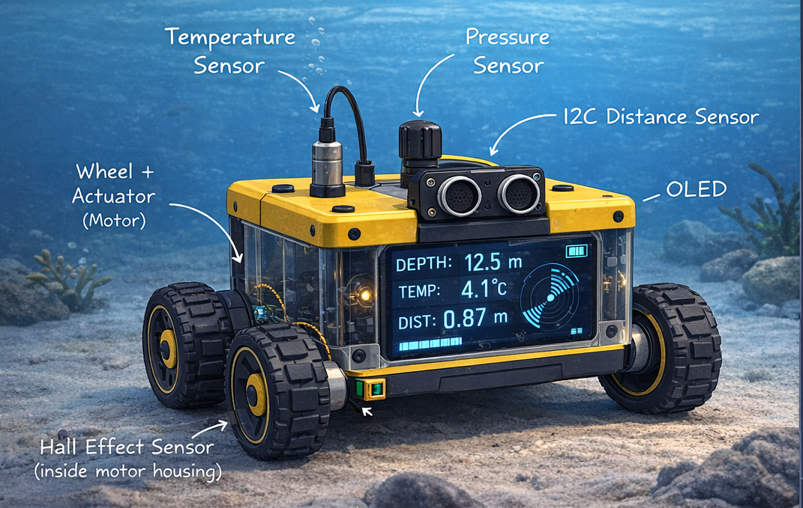
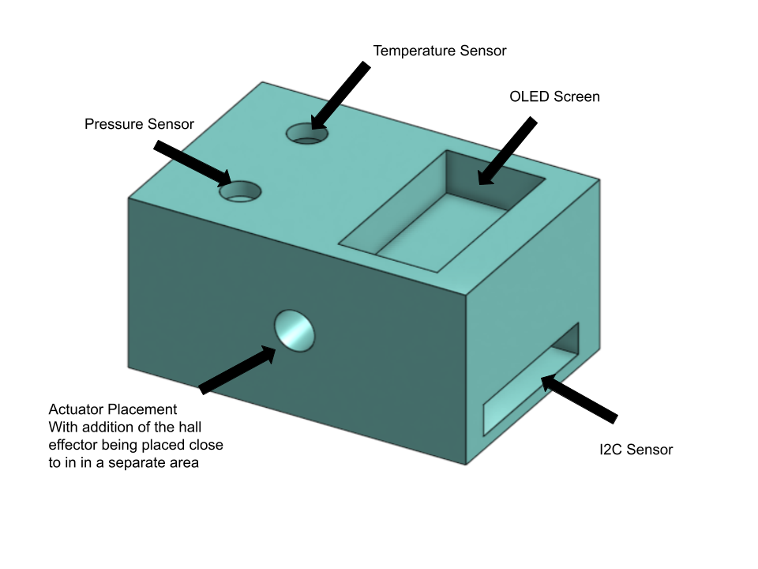

## What is the goal of our exploration device?

With Team 307’s exploration device, a submersible system, the primary goal is to explore and analyze water environments. The device is intended to navigate underwater and along the water’s surface to collect environmental samples and remove waste. It will be capable of operating in ideal aquatic environments, adapting to changes in depth from pressure, temperature, and water movement through sensor feedback from the teams combined microcontroller system. As an exploration device, the system is designed for extended missions away from a base of operations, requiring it to be self sufficient, energy efficient, and resistant to water intrusion. Overall, the goal is to provide a exploration inspired platform focused exclusively on improving and studying water enviorments.

## Who is our audience?

Our project is intended for indivduals who study aquatic environments, including freshwater and marine ecosystems. The system is designed to collect environmental samples, monitor water conditions, and remove waste from bodies of water. It would be especially useful for those analyzing pollution, water quality, and ecosystem health. Overall, this project supports individuals working to better understand and protect aquatic environments.

## Generated Ideas and Ranking

During the ideation phase over 100 ideas were brought up as a team and organized into seven functional themes. Each theme was later put 
in concepts and ranked based on feasibility and alignment with project requirements. The complete, unfiltered list of generated ideas
is provided in Appendix - [02 Concept Generations](https://egr-314-team-307-spring-2026.github.io/Team307.github.io/Appendix/02-ConceptGenrations/Append-Concepts/).

---

### 1. Mobility & Amphibious Navigation (Ranked)

| Rank | Idea | Rank | Idea |
|---|---|---|---|
| 1 | Rover Suspension System | 9 | Ballast tanks |
| 2 | Steering Capabilities | 10 | NASA Design Wheels |
| 3 | Twin motor | 11 | Raft dispenser |
| 4 | Omni wheels | 12 | 4x4 capability |
| 5 | Propeller / wheel design | 13 | Parachute system |
| 6 | Tank treads | 14 | Butterfly drive train |
| 7 | Amphibious design (Rover into Submarine or surface floater) | 15 | H drive train |
| 8 | Propeller / wheel design | 16 | Wings for gliding |
|  |  | 17 | Rocket thruster |

---

### 2. Sensing & Environmental Analysis (Ranked)

| Rank | Idea | Rank | Idea |
|---|---|---|---|
| 1 | Atmospheric sensor | 9 | Weather proof |
| 2 | Hygrometer | 10 | Radar Scanning |
| 3 | Infrared sensor | 11 | Spectrometer |
| 4 | Motion sensor | 12 | Altimeter |
| 5 | Light panel activation sensor | 13 | Geiger counter |
| 6 | High res camera | 14 | Chemistry Camera (Curiosity rover) |
| 7 | Lidar scanner | 15 | SuperCam (Perseverance rover) |
| 8 | Sonic sensors | 16 | PXIL |

---

### 3. Sample Collection (Ranked)

| Rank | Idea | Rank | Idea |
|---|---|---|---|
| 1 | Water sample collector | 10 | Brush |
| 2 | Rock / Earth sample collector | 11 | Vacuum |
| 3 | Metal blade for bulldozing | 12 | Dust pan |
| 4 | Robotic arm | 13 | Rock pick |
| 5 | Sieve | 14 | On-board robot manipulator |
| 6 | Different mesh screens for the sieve | 15 | Centrifuge for analysis |
| 7 | Plant collector (samples) | 16 | Jack hammer |
| 8 | Drill to make samples | 17 | Acid storage |
| 9 | Shovel, Hammer, and Drill for excavation |  |  |

---

### 4. Power & Energy Systems (Ranked)

| Rank | Idea | Rank | Idea |
|---|---|---|---|
| 1 | Long-lasting battery pack | 7 | Wind turbine |
| 2 | Solar panels | 8 | Water wheels |
| 3 | Overheating shutdown, if internal temp too hot | 9 | Hydrogen powered |
| 4 | Water cooling | 10 | Hydrolysis battery |
| 5 | Liquid cooling (coolant, not water) | 11 | Wall plug Power NA |
| 6 | Water filtration system | 12 | Nuclear fusion battery |

---

### 5. User Interface & Communication (Ranked)

| Rank | Idea | Rank | Idea |
|---|---|---|---|
| 1 | Human-machine - interface | 8 | RGB headlights |
| 2 | Microphone / Speaker set for communication | 9 | RGB detection light flash |
| 3 | Bluetooth connection | 10 | USB-C ports for external connection |
| 4 | Wifi app | 11 | Light panel activation sensor |
| 5 | Alarm system | 12 | Live feed camera |
| 6 | A hidden button that forces rover to stop completely | 13 | Video screen prompt |
| 7 | Built-in speakers (aux) | 14 | On board Morse code system |

---

### 6. Durability, Safety & Reliability (Ranked)

| Rank | Idea | Rank | Idea |
|---|---|---|---|
| 1 | Waterproof coating | 7 | High durability steel chassis |
| 2 | Anti-corrosive coating | 8 | Internal controller |
| 3 | Internal water sensor to check for leaks | 9 | Alarm recovery system (SOS) |
| 4 | External Water Sensor | 10 | Low-profile internal PCB |
| 5 | Durable, lightweight, detachable housing | 11 | Internal fire suppression system |
| 6 | Plastic casings for internal PCBs |  |  |

---

### 7. Technological (Ranked)

| Rank | Idea | Rank | Idea |
|---|---|---|---|
| 1 | Distance control based on temperature | 6 | Fiber optic cables |
| 2 | Speed control based on temperature | 7 | 3d printer for quickly making replacement parts |
| 3 | Device-hosted AI system | 8 | Printer |
| 4 | Self-driving capabilities | 9 | Fax machine |
| 5 | Drone bay built into the rover | 10 | RTx5090 |

---

# Initial 3 Product Concepts (Practical & Usable)
The amphibious trash collector is designed as a multi-role platform capable of scientific testing, environmental interaction, efficient power management, and advanced mobility. For the purposes of concept 
development, we are focusing on the Big 3 efficiency pillars — the core functional areas that define the collector’s most practical and usable capabilities.
The full ideation list, including additional features and experimental concepts, can be found in the [Appendix](https://egr-314-team-307-spring-2026.github.io/Team307.github.io/Appendix/02-Concept-Genrations/Append-Concepts/)

---

## 1. Scientific & Environmental Efficiency
*Observation, analysis, and sample handling.*

### Key Features
- Spectrometer, Chemistry Camera, High-resolution camera  
- Lidar / Radar scanning  
- Atmospheric & environmental sensors (temperature, humidity, radiation)  
- Rock, soil, water, and plant sample collectors  
- Drill & shovel for sampling  
- Device-hosted AI system for data analysis  

---

## 2. Power & Thermal Management Efficiency
*Reliable energy and temperature control for long missions.*

### Key Features
- Long-lasting batteries  
- Solar panels (primary supplemental energy)  
- Liquid coolant / water-based cooling  
- Overheating shutdowns & fire suppression  
- Weather-proof, corrosion-resistant construction  

---

## 3. Mobility & Operational Efficiency
*Terrain adaptability, navigation, and basic manipulation.*

### Key Features
- 4×4 drive with twin motors  
- Suspension system & NASA-inspired wheels  
- Amphibious capability (limited surface-water operation)  
- Robotic arm / manipulator  
- Motion & basic navigation sensors  
- USB-C / Wi-Fi / Bluetooth connectivity  
- Emergency stop & basic alarm system  

## Scientific & Environmental Interaction Efficiency

Most of the features are about collecting, moving, and handling samples, which is squarely in this group:

* Bulldozer Arm – lifts samples into compartments, scoops with teeth, debris handling.
* Two Sample Compartments – organizes collected material, environmental interaction.
* Sensor Window – helps navigate while collecting, supports operational collection efficiency.

## 2. Power & Thermal Management Efficiency

WALL‑E–style power module is primarily about:

* Structural design language (boxy, modular, low-center-of-gravity).
* Chassis form factor (stacked energy and control modules, rugged housing).
* Energy & thermal presence (compact battery bricks, integrated cooling, solar panel “arms”).
* Operational robustness (impact-resistant casing, water- and debris-proof, easy field maintenance).

[The wheels that were talked about within the rover product concept](https://rebrickable.com/mocs/MOC-78205/zumaidi/wall-e-wheels/#details)

## TRAVEL, MOBILITY & OPERATIONAL EFFICIENCY

The hybrid concept is primarily about:

* Structural design language (angular, aggressive, low-profile).
* Chassis form factor (wide stance, rigid geometry).
* Mobility presence (stability, ground clearance, durability).
* Operational robustness (impact resistance, enclosure protection).

## Initial Design Concept
Team 307 has initially selected this model as our final concept for the product. This design effectively showcases the desired features of the amphibious exploration rover that Team 307 was striving to create, such as a 
durable treading/suspension system, a modular chassis for continuous improvement, and detailed annotations to help the onlooker understand the design concept. (Design Credit - Abriana Poola)

[Lego Wheels that were thought of when designing final concept](https://rebrickable.com/mocs/MOC-78205/zumaidi/wall-e-wheels/#details)

## Updated Submersible Exploration Device Concept

Throughout the project’s development, Team 307 refined its design focus and transitioned to a fully submersible exploration system specifically for aquatic environments. Rather than dividing functionality between land and water, the team chose to concentrate on the fine tuning the water aspect. This decision allows for system efficiency, simplified mechanical design, and strong integration of underwater sensing capabilities. With its current data collection and environmental monitoring features, the submersible platform more effectively fulfills its intended role as an exploration device focused on aquatic environments.

With the usage of Generative AI, we were able to get an idea of a possible design for the final product from the given image above to get an idea of where certain placements of several components could be placed. Despite the detail, there were changes to the casing which is shown in the following image:

Majority of the components for this project is given by the class, so instead of having a huge OLED Screen, we decided to create a little section where the OLED can be placed, along with it's buttons. It is then closed with a little hatch to ensure that no water enters the area. The actuator and hall effect sensor will be working side by side to ensure mobility of the machinery. Temperature and Pressure sensors will have cylander gauges to get the readings of the environment, while the I2C sensor has its own compartment in the front of the face of the casing, but towards the bottom as to detect objects in front while in driver mode.

