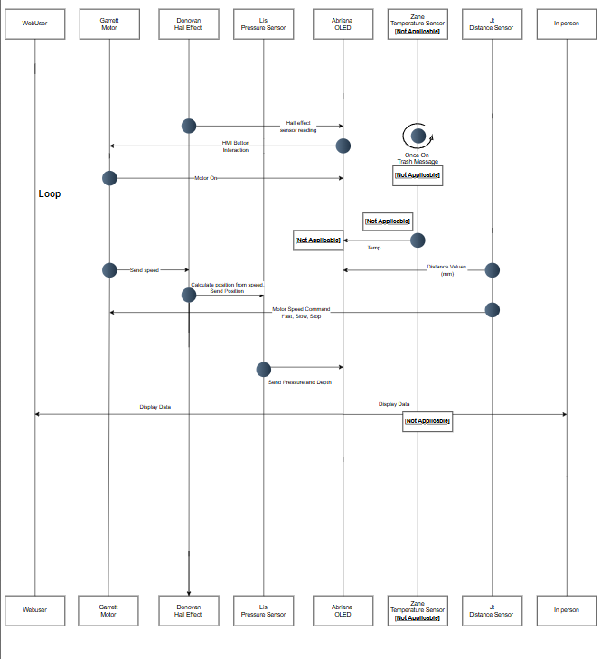

## Overview

For our teams’s system, we built it using a daisy chain system where each teammate designs a dedicated subsystem board. Communication between boards occurs through a 8 pin ribbon connector using digital serial signals. The team includes sensing subsystems (distance, pressure, temperature), motor control for actuation, and human interface modules. Each board includes its own power regulation and microcontroller (PIC or ESP32), allowing independent operation as well as full system integration.

## Team Block Diagram

*Block Diagram PDF: [Download here](Team307_Block_Diagram.drawio.pdf)*

 The block diagram as a team, we decided that pin 8 would be shared ground so ensure stable connection throughout the communication when adding together all the components. Furthermore, shared power is through pin 1, The team decided to have pin 2 as the uart pin, and pin 8 is the shared ground. With that the block diagram is divided up into 6 subsystems that connect through a daisy chain loop. JT subsystem is sending a digital signal connection to Garret subsystem as well as sending data out to Zane subsystem. Zane subsystem is storing the data given from JT subsystem as well as computing data from a temperature sesor and displays both data's to Abriana OLED subsystem. Abriana subsystem also is sending data out to Garrets subsystem. garret subsystem sends digital signal to 8 pin connector onto Donovan subsystem. Donovan subsystem `takes the digital data, then makes the Uart from the subsystem and sends that data to Elisabeth subsystem. Elisabeth subsystem takes the data recieved from Donovan subsystem along with computing pressure sensor values, sends the data to  Abriana subsystem where the data is stored and then displayed on the OLED in  Abriana subsystem.

## Sequence Diagram of Team Communication

 *Sequence Diagram draw.io: [website](https://app.diagrams.net/?src=about#G16IhPEk2CgQ-QdMvY7qi-FTfsWQHPuqO4#%7B%22pageId%22%3A%22t7_Y112LHUEoPPghb1Yn%22%7D)*

This sequence diagram illustrates the interactions within our sensor-driven submersible. The system continuously reads sensor data to calculate speed and position, avoid obstacles, and measure ambient water temperature and pressure. Additionally, this information is displayed on an onboard OLED screen. The loop ensures ongoing updates of sensor readings and motor adjustments when obstacles are detected. Overall, the diagram shows a coordinated flow of data throughout the system among its 6 parts.

## Message proctol

Team 307's message protocol is as follows. The first and second bytes of every message sent through the UART will be 'AZ'. Followed by a third byte, the sender ID, which is just the sender's capitalized initial. The fourth is the receiver ID, the receiver's capitalized initial. The following bytes contain data defined by the types in the section below. Then the end of the message will be two bytes that write out 'YB'. Additionally, no messages will exceed 64 bytes.

An example of a message sent between devices is "AZEAHelloYB".

The list of sender/receiver IDs is "A, D, E, G, J, and Z."

## Message Types

## Team 307 – Message Types (uint16_t)

| Message Type | Description |
|--------------|------------|
| 1 | Set motor command |
| 2 | Motor status report |
| 3 | Motor speed report |
| 4 | Distance value (mm) |
| 5 | Hall sensor value |
| 6 | Depth/Pressure value |
| 7 | Temperature value (No Tested Value) |
| 8 | HMI button event |

---

### Message Type 1 – Set Motor Command

| Byte 1–2 | Byte 3 | Byte 4 | Byte 5-62| Last 2 Bytes |
|---------------------|------------------|----------------------|-----------|-----------|
| AZ | J | G | Speed setting | YB |

### Message Type 2 – Motor Status Report

| Byte 1–2 | Byte 3 | Byte 4 | Byte 5-62| Last 2 Bytes |
|---------------------|------------------|----------------------|-----------|-----------|
| AZ | G | A | Motor Status | YB |

### Message Type 3 – Motor Speed Report

| Byte 1–2 | Byte 3 | Byte 4 | Byte 5-62| Last 2 Bytes |
|---------------------|------------------|----------------------|-----------|-----------|
| AZ | G | D | Motor Speed | YB |

### Message Type 4 – Distance Value (mm)

| Byte 1–2 | Byte 3 | Byte 4 | Byte 5-62| Last 2 Bytes |
|---------------------|------------------|----------------------|-----------|-----------|
| AZ | J | A | Distance | YB |

### Message Type 5 – Hall Sensor Value

| Byte 1–2 | Byte 3 | Byte 4 | Byte 5-62| Last 2 Bytes |
|---------------------|------------------|----------------------|-----------|-----------|
| AZ | D | A | Distance | YB |

### Message Type 6 – Depth/Pressure Value

| Byte 1–2 | Byte 3 | Byte 4 | Byte 5-62| Last 2 Bytes |
|---------------------|------------------|----------------------|-----------|-----------|
| AZ | E | A | Depth and pressure | YB |

### Message Type 7 – Temperature Value (No Tested Value)

| Byte 1–2 | Byte 3 | Byte 4 | Byte 5-62| Last 2 Bytes |
|---------------------|------------------|----------------------|-----------|-----------|
| AZ | Z | A | Temprature | YB |

### Message Type 8 – HMI Button Event

| Byte 1–2 | Byte 3 | Byte 4 | Byte 5-62| Last 2 Bytes |
|---------------------|------------------|----------------------|-----------|-----------|
| AZ | A | G | Button Press | YB |

## 5 Biggest Software Changes

### Pass through logic
- Initially the design only considered sending and receiving messages but was updated to include pass through logic, where each board checks if the message is for itself or another team member. If not the message is forwarded and necessary to support the daisy chain.

### Switched Sensor to Change only when state changes instead of continously
- The system continuously transmitted STOP, SLOW, and FAST states but during development, this was modified so that messages are only sent when the state changes. This reduced unnecessary communication traffic.

