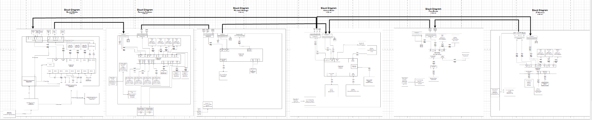

## Overview

For our teams’s system, we built it using a daisy chain system where each teammate designs a dedicated subsystem board. Communication between boards occurs through a 8 pin ribbon connector using digital serial signals. The team includes sensing subsystems (distance, pressure, temperature), motor control for actuation, and human interface modules. Each board includes its own power regulation and microcontroller (PIC or ESP32), allowing independent operation as well as full system integration.

## Team Block Diagram

*Block Diagram PDF: [Download here](Team314pdf_drawio.pdf)*

 The block diagram as a team, we decided that pin 8 would be shared ground so ensure stable connection throughout the communication when adding together all the components. Furthermore, shared power is through pin 1, The team decided to have pin 2 as the uart pin, and pin 8 is the shared ground. With that the block diagram is divided up into 6 subsystems that connect through a daisy chain loop. Zane subsystem is storing the data given from JT subsystem as well as computing data from a temperature sesor and displays that data to Abriana OLED subsystem.

## Sequence Diagram of Team Communication

*Sequence Diagram draw.io: [website](https://app.diagrams.net/?src=about#G16IhPEk2CgQ-QdMvY7qi-FTfsWQHPuqO4#%7B%22pageId%22%3A%22t7_Y112LHUEoPPghb1Yn%22%7D)*

This sequence diagram illustrates the interactions within a sensor-driven submersible where a WebUser sets parameters that initialize the sensors and motors. Garrett Motor, Donovan Hall 
Effect sensor, Lis Pressure Sensor, Zane Temperature Sensor, and Jt Distance Sensor all power on and begin sending status and data messages. The system continuously reads sensor data, 
calculates speed and position, and sends obstacle and temperature readings. This information is displayed on Abriana’s OLED screen, while debug messages are exchanged to monitor system 
status. The loop ensures ongoing updates and adjustments, with safety checks to stop motors if obstacles are detected. Overall, the diagram shows a coordinated flow of initialization, data 
acquisition, processing, display, and debugging within the system.

## Message Type

## Team 307 – Message Types (uint16_t)

| Message Type | Description |
|--------------|------------|
| 1 | Set motor command |
| 2 | Motor status report |
| 3 | Distance value (mm) |
| 4 | Hall sensor value |
| 5 | Depth/Pressure value |
| 6 | Temperature value |
| 7 | HMI display update |
| 8 | HMI button event |
| 9 | System status request |
| 10 | System status response |
| 11 | Error code |
| 12 | Emergency stop |

---

### Message Type 1 – Set Motor Command

| Byte 1–2 (uint16_t) | Byte 3 (uint8_t) | Byte 4–5 (uint16_t) | Byte 6–58 |
|---------------------|------------------|----------------------|-----------|
| 0x01 | direction | speed | 0x00 padding |

### Message Type 2 – Motor Status Report

| Byte 1–2 (uint16_t) | Byte 3 (uint8_t) | Byte 4–5 (uint16_t) | Byte 6–58 |
|---------------------|------------------|----------------------|-----------|
| 0x02 | motor state | current speed | 0x00 padding |

### Message Type 3 – Distance Value (mm)

| Byte 1–2 (uint16_t) | Byte 3–4 (uint16_t) | Byte 5–58 |
|---------------------|----------------------|-----------|
| 0x03 | distance mm | 0x00 padding |

### Message Type 4 – Hall Sensor Value

| Byte 1–2 (uint16_t) | Byte 3–4 (uint16_t) | Byte 5–58 |
|---------------------|----------------------|-----------|
| 0x04 | hall value | 0x00 padding |

### Message Type 5 – Depth/Pressure Value

| Byte 1–2 (uint16_t) | Byte 3–4 (uint16_t) | Byte 5–58 |
|---------------------|----------------------|-----------|
| 0x05 | depth or pressure_value | 0x00 padding |

### Message Type 6 – Temperature Value

| Byte 1–2 (uint16_t) | Byte 3–4 (uint16_t) | Byte 5–58 |
|---------------------|----------------------|-----------|
| 0x06 | temperature value | 0x00 padding |

### Message Type 7 – HMI Display Update

| Byte 1–2 (uint16_t) | Byte 3 (uint8_t) | Byte 4–5 (uint16_t) | Byte 6–58 |
|---------------------|------------------|----------------------|-----------|
| 0x07 | display page | display_value | 0x00 padding |

### Message Type 8 – HMI Button Event

| Byte 1–2 (uint16_t) | Byte 3 (uint8_t) | Byte 4 (uint8_t) | Byte 5–58 |
|---------------------|------------------|------------------|-----------|
| 0x08 | button id | event | 0x00 padding |

### Message Type 9 – System Status Request

| Byte 1–2 (uint16_t) | Byte 3–58 |
|---------------------|-----------|
| 0x09 | 0x00 padding |

### Message Type 10 – System Status Response

| Byte 1–2 (uint16_t) | Byte 3 (uint8_t) | Byte 4–58 |
|---------------------|------------------|-----------|
| 0x0A | status code | 0x00 padding |

### Message Type 11 – Error Code

| Byte 1–2 (uint16_t) | Byte 3–4 (uint16_t) | Byte 5–58 |
|---------------------|----------------------|-----------|
| 0x0B | error code | 0x00 padding |

### Message Type 12 – Emergency Stop

| Byte 1–2 (uint16_t) | Byte 3–58 |
|---------------------|-----------|
| 0x0C | 0x00 padding |

