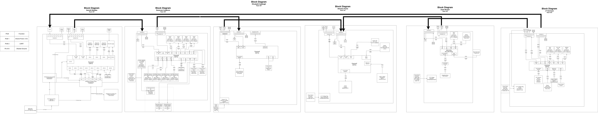

## Overview

For our teams’s system, we built it using a daisy chain system where each teammate designs a dedicated subsystem board. Communication between boards occurs through a 8 pin ribbon connector using digital serial signals. The team includes sensing subsystems (distance, pressure, temperature), motor control for actuation, and human interface modules. Each board includes its own power regulation and microcontroller (PIC or ESP32), allowing independent operation as well as full system integration.

## Team Block Diagram

*Block Diagram PDF: [Download here](FinalZBlock.pdf)*

*Website Link to Diagram: [Download Here](https://app.diagrams.net/#G1TzR9Rzn8crqcAduowQvzkdC1z6Y6g4mR#%7B%22pageId%22%3A%22ghmqmM-_OBGlNxdhGzXK%22%7D)*

The team’s block diagram was designed with pin 8 as a shared ground to ensure a stable connection across all components during communication. Additionally, pin 1 is used for shared power, and pin 2 is designated as the UART communication pin.

The system is divided into six subsystems connected in a daisy-chain loop. The JT subsystem sends a digital signal to the Garret subsystem and transmits data to the Zane subsystem. The Zane subsystem stores the data received from JT, processes data from a temperature sensor, and sends both sets of data to the Abriana OLED subsystem for display.

The Abriana subsystem also transmits data to the Garret subsystem. The Garret subsystem then sends a digital signal through the 8-pin connector to the Donovan subsystem. The Donovan subsystem receives this digital data, converts it into UART format, and forwards it to the Elisabeth subsystem.

Finally, the Elisabeth subsystem processes the data received from Donovan along with pressure sensor readings, then sends the combined data back to the Abriana subsystem, where it is stored and displayed on the OLED.

## Sequence Diagram of Team Communication

*Sequence Diagram draw.io: [website](https://app.diagrams.net/?src=about#G16IhPEk2CgQ-QdMvY7qi-FTfsWQHPuqO4#%7B%22pageId%22%3A%22t7_Y112LHUEoPPghb1Yn%22%7D)*

*PDF of the Sequence Diagram: [PDF Sequence](System.pdf)*

This sequence diagram illustrates the interactions within our sensor-driven submersible. The system continuously reads sensor data to calculate speed and position, avoid obstacles, and measure ambient water temperature and pressure. Additionally, this information is displayed on an onboard OLED screen. The loop ensures ongoing updates of sensor readings and motor adjustments when obstacles are detected. Overall, the diagram shows a coordinated flow of data throughout the system among its 6 parts.

## Message Protocol

Team 307's message protocol is as follows. The first and second bytes of every message sent through the UART will be 'AZ'. Followed by a third byte, the sender ID, which is just the sender's capitalized initial. The fourth is the receiver ID, the receiver's capitalized initial. The following bytes contain data defined by the types in the section below. Then the end of the message will be two bytes that write out 'YB'. Additionally, no messages will exceed 64 bytes.

An example of a message sent between devices is "AZEAHelloYB".

The list of sender/receiver IDs is "A, D, E, G, J, and Z."

## Message Types

## Team 307 – Message Types (uint16_t)

| Message Type | Description |
|--------------|------------|
| 1 | Set motor command |
| 2 | Motor status report |
| 3 | Motor speed report |
| 4 | Distance value (mm) |
| 5 | Hall sensor value |
| 6 | Depth/Pressure value |
| 7 | Temperature value (No Tested Value) |
| 8 | HMI button event |

---

### Message Type 1 – Set Motor Command

| Byte 1–2 | Byte 3 | Byte 4 | Byte 5-62| Last 2 Bytes |
|---------------------|------------------|----------------------|-----------|-----------|
| AZ | J | G | Speed setting | YB |

### Message Type 2 – Motor Status Report

| Byte 1–2 | Byte 3 | Byte 4 | Byte 5-62| Last 2 Bytes |
|---------------------|------------------|----------------------|-----------|-----------|
| AZ | G | A | Motor Status | YB |

### Message Type 3 – Motor Speed Report

| Byte 1–2 | Byte 3 | Byte 4 | Byte 5-62| Last 2 Bytes |
|---------------------|------------------|----------------------|-----------|-----------|
| AZ | G | D | Motor Speed | YB |

### Message Type 4 – Distance Value (mm)

| Byte 1–2 | Byte 3 | Byte 4 | Byte 5-62| Last 2 Bytes |
|---------------------|------------------|----------------------|-----------|-----------|
| AZ | J | A | Distance | YB |

### Message Type 5 – Hall Sensor Value

| Byte 1–2 | Byte 3 | Byte 4 | Byte 5-62| Last 2 Bytes |
|---------------------|------------------|----------------------|-----------|-----------|
| AZ | D | A | Distance | YB |

### Message Type 6 – Depth/Pressure Value

| Byte 1–2 | Byte 3 | Byte 4 | Byte 5-62| Last 2 Bytes |
|---------------------|------------------|----------------------|-----------|-----------|
| AZ | E | A | Depth and pressure | YB |

### Message Type 7 – Temperature Value (No Tested Value)

| Byte 1–2 | Byte 3 | Byte 4 | Byte 5-62| Last 2 Bytes |
|---------------------|------------------|----------------------|-----------|-----------|
| AZ | Z | A | Temprature | YB |

### Message Type 8 – HMI Button Event

| Byte 1–2 | Byte 3 | Byte 4 | Byte 5-62| Last 2 Bytes |
|---------------------|------------------|----------------------|-----------|-----------|
| AZ | A | G | Button Press | YB |

## 5 Biggest Software Changes

### Pass-Through Logic
* Initially, the design only supported sending and receiving messages. It was later updated to include pass-through logic, where each board checks whether a message is intended for itself or another subsystem. If the message is not intended for that board, it is forwarded along the chain. This functionality is essential for supporting the daisy-chain architecture.

### State-Based Sensor Transmission
* The system originally transmitted STOP, SLOW, and FAST states continuously. During development, this was modified so that messages are only sent when the state changes. This significantly reduced unnecessary communication traffic.

### Removal of MQTT from the Final Design
* The original software design included MQTT for wireless communication and remote monitoring. However, the team was unable to complete the MQTT setup in time, so it was removed from the final working version. The system now relies on the UART protocol for communication between subsystems, making it simpler and more reliable for the final demonstration. MQTT remains a potential future improvement for remote monitoring and cloud data logging.

### Refined Message Structure for Reliability
* The initial message structure was basic, but it was refined during development to include consistent start and end markers (AZ and YB), sender and receiver IDs, and properly formatted data fields. These improvements made debugging easier and ensured messages were not misread or corrupted during transmission between subsystems.
Motor Function Red

### Motor Function Redesign
* In the initial version, the JT subsystem was directly connected to Garret’s motor and was not part of the daisy-chain system. This approach was later scrapped. It was determined that using UART communication through the team’s RX/TX pins was more effective. This change simplified the code and improved overall communication organization.

