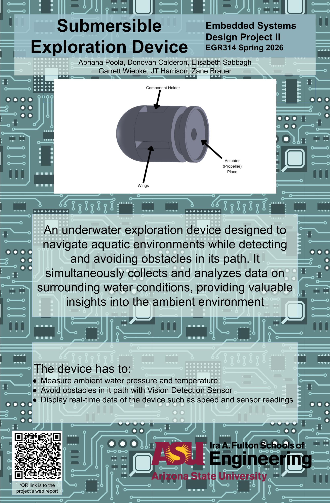
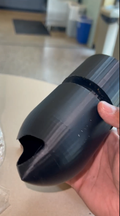

## Overview

This video is a showcase of Team 307's website and what has been accomplished throughout the half of the semester. It goes over the introduction before talking about the design concept portion of the website. Afterwards, it focuses on the requirements created that helped shaped our team block diagram and our message type used. Furthermore, it goes in-depth about the individual block diagram of each member of Team 307 and how each subsystem works with one another to get our final product.
[Youtube Video](https://youtu.be/xaXJSqSmxxg)

## Innovation Showcase Poster

*Poster PDF: [Download here](307-poster.pdf)*

## Final Design Concept Visual

  <video controls preload="metadata" style="width: 100%; max-width: 700px;">
    <source src="./video307.mp4" type="video/mp4">
    Your browser does not support the video tag.
  </video>

